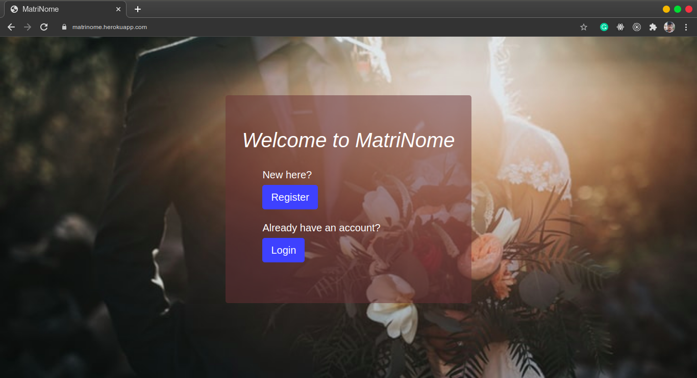

# MatriNome :sparkling_heart: #
### A website for matching two soulmates ###

### Key Points
- A profile matching website where people link with each other.

- Users fill their profile and see the profile of other users based on their **interests listed in the profile** and on the basis of the **filters they apply**.
 
- Now if the user wants, they can choose to `smash` or `pass` and then the request is sent to the other user, who can *accept* or <del>decline</del> their request.

- Mails are sent to notify users on various events such as `signup`, `request received`, `request accepted` etc.

View it live [here](https://matrinome.herokuapp.com/) on Heroku.

### Sneak Peeks

### Local Setup
<h5>Clone the repository</h5>
<pre>git clone https://github.com/sp35/MatriNome.git</pre>
<h5>Make a new Virtual Environment</h5>
<pre>virtualenv -p python3 venv</pre>
<h5>Activating the Virtual Environment</h5>
<pre>source venv/bin/activate</pre>
<h5>Shifitng to the project repository</h5>
<pre>cd MatriNome</pre>
<h5>Install the required modules</h5>
<pre>pip install -r utils/requirements.txt</pre>
<h5>Run the migrations and Synchronize the Database using</h5>
<pre>python manage.py migrate --run-syncdb</pre>
<h5>Create a superuser</h5>
<pre>python manage.py createsuperuser</pre>
<h5>Run the server</h5>
<pre>python manage.py runserver</pre>
<h5>Now open up your browser at http://127.0.0.1:8000/ and the project is 
hosted on your local setup.</h5>
<h4>Procedure to host the application on your local network (For Ubuntu)</h4>
<pre>ip address</pre>
<h5>You would see an output like this</h5>
<pre>
...
3: wlp2s0: ...
    inet <b>172.17.69.115/23</b> brd 172.17.69.255 ....
...
</pre>
<h5>This IP is of our interest. Now just simply run</h5>
<pre>python manage.py runserver 0.0.0.0:8000</pre>
<h5>Alternatively:</h5> <pre>python manage.py runserver 172.17.69.115:8000</pre>
<h5>And the application can now be accessed by anyone on the same network as you at:</h5>
<pre>http://172.17.69.115:8000</pre>
<h5>Also, in all the above <code>runserver</code> commands, you can specify a port number of your choice.</h5>
<h5>Note: Some ports are blocked and cannot be used.</h5>

### Acknowledgements
Thanks to HTML5Up for it's *Phantom* Template.
